## 1. Objective

**Task**: binary classification (`stress` vs `non-stress`) from Reddit posts.  
**Goal**: compare two modeling strategies and explain predictions.

- Interpretable baseline (handcrafted features + Logistic Regression)
- Contextual model (DistilBERT fine-tuning)
- Explainability stack (coefficients + SHAP + Integrated Gradients)

## 2. Project Structure Used in This Presentation

This presentation is based on the notebooks:

- `notebooks/01_eda.ipynb.ipynb`
- `notebooks/02_train_baseline.ipynb`
- `notebooks/03_train_transformer.ipynb`
- `notebooks/04_explainability.ipynb`

and on generated outputs in:

- `results/eda/`
- `results/baseline/`
- `results/transformer/`
- `results/explainability/`

## 3. Data Loading and Shared Split Logic

From `notebooks/03_train_transformer.ipynb`:

```python
train_idx_path = "../data/train_idx.npy"
test_idx_path = "../data/test_idx.npy"

if os.path.exists(train_idx_path) and os.path.exists(test_idx_path):
    train_idx = np.load(train_idx_path)
    test_idx = np.load(test_idx_path)
else:
    all_idx = df.index.to_numpy()
    labels = df["label"].astype(int)
    train_idx, test_idx = train_test_split(
        all_idx, test_size=0.2, random_state=RANDOM_STATE, stratify=labels
    )
```

This keeps baseline/transformer comparison consistent on the same split.

## 4. EDA – Main Signals

::: {.columns}
::: {.column width="33%"}
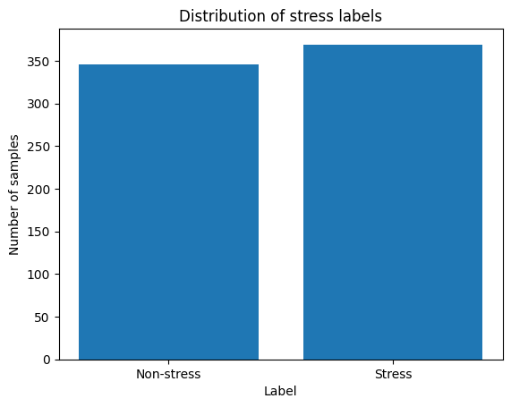{fig-alt="Label distribution"}
:::
::: {.column width="33%"}
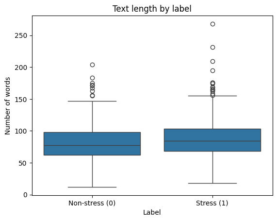{fig-alt="Text length by label"}
:::
::: {.column width="33%"}
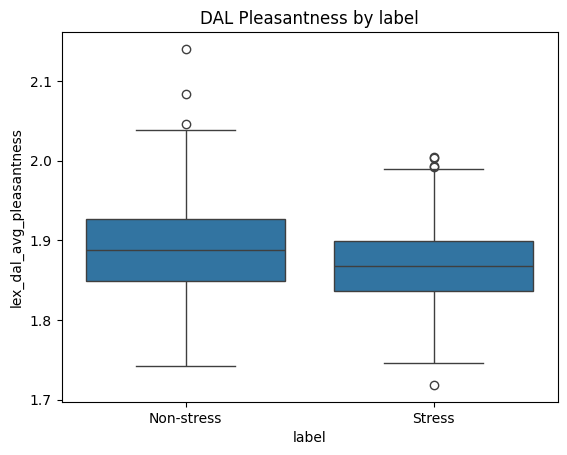{fig-alt="Pleasantness by label"}
:::
:::

EDA conclusions used for modeling:

- class distribution is close to balanced
- text length alone is weakly discriminative
- affective/psycholinguistic variables carry stronger signal

## 5. Baseline Model – Feature Engineering and Pipeline

From `notebooks/02_train_baseline.ipynb`:

```python
FEATURES = [
    "syntax_ari", "syntax_fk_grade", "lex_liwc_WC", "lex_liwc_Authentic",
    "lex_liwc_Tone", "lex_dal_avg_pleasantness", "lex_dal_avg_activation",
    "lex_dal_avg_imagery", "sentiment", "lex_liwc_i", "lex_liwc_negemo",
    "lex_liwc_anx", "lex_liwc_sad", "lex_liwc_negate", "lex_liwc_social"
]

pipe = Pipeline(steps=[
    ("imputer", SimpleImputer(strategy="median")),
    ("scaler", StandardScaler()),
    ("clf", LogisticRegression(max_iter=2000, random_state=RANDOM_STATE))
])
```

Design target: strong interpretability + stable baseline performance.

## 6. Baseline Evaluation – Hot Sections

From `notebooks/02_train_baseline.ipynb`:

```python
y_pred = pipe.predict(X_test)
print(classification_report(y_test, y_pred, digits=3))

y_proba = pipe.predict_proba(X_test)[:, 1]
roc_auc = roc_auc_score(y_test, y_proba)
ap = average_precision_score(y_test, y_proba)
```

Threshold optimization section:

```python
thresholds = np.linspace(0.1, 0.9, 50)
for t in thresholds:
    y_pred_thresh = (y_proba >= t).astype(int)
    f1_scores.append(f1_score(y_test, y_pred_thresh, average="macro"))
```

## 7. Baseline Results

Baseline summary used in report (`reports/results.md`):

| Metric | Value |
|---|---:|
| Accuracy | 0.748 |
| Macro F1 | 0.748 |
| ROC-AUC | 0.814 |
| AP (PR-AUC) | 0.769 |
| Best threshold | 0.54 |

::: {.columns}
::: {.column width="33%"}
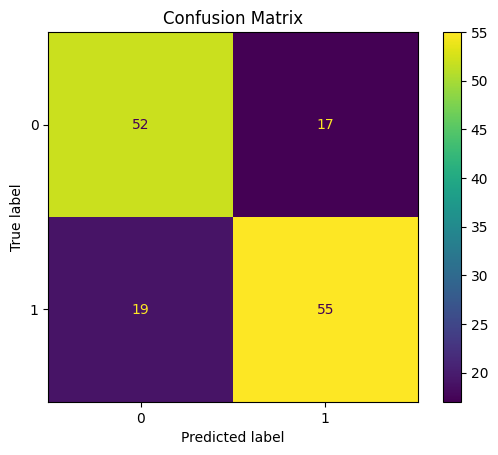{fig-alt="Baseline confusion matrix"}
:::
::: {.column width="33%"}
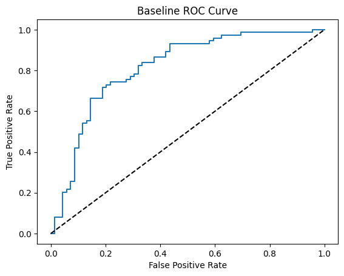{fig-alt="Baseline ROC curve"}
:::
::: {.column width="33%"}
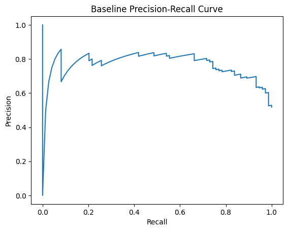{fig-alt="Baseline PR curve"}
:::
:::

## 8. Transformer Model – Tokenization and Dataset Build

From `notebooks/03_train_transformer.ipynb`:

```python
MODEL_NAME = "distilbert-base-uncased"
tokenizer = AutoTokenizer.from_pretrained(MODEL_NAME)

train_ds = Dataset.from_dict({"text": X_train, "label": y_train})
test_ds  = Dataset.from_dict({"text": X_test,  "label": y_test})

def tokenize(batch):
    return tokenizer(batch["text"], truncation=True, padding="max_length", max_length=128)
```

HF login option added for faster model downloads / higher hub limits.

## 9. Transformer Fine-Tuning – Key Configuration

From `notebooks/03_train_transformer.ipynb`:

```python
args = TrainingArguments(
    output_dir="../results/transformer/distilbert",
    eval_strategy="epoch",
    save_strategy="epoch",
    load_best_model_at_end=True,
    metric_for_best_model="f1_macro",
    num_train_epochs=3,
    per_device_train_batch_size=16,
    per_device_eval_batch_size=32,
    learning_rate=2e-5,
    weight_decay=0.01,
    seed=RANDOM_STATE,
)
```

```python
trainer = Trainer(
    model=model,
    args=args,
    train_dataset=train_tok,
    eval_dataset=test_tok,
    compute_metrics=compute_metrics,
)
trainer.train()
```

## 10. Transformer Evaluation – Same Stack as Baseline

From `notebooks/03_train_transformer.ipynb`:

```python
pred = trainer.predict(test_tok)
logits = pred.predictions
y_pred = np.argmax(logits, axis=-1)

roc_auc = roc_auc_score(y_true, y_proba)
ap = average_precision_score(y_true, y_proba)
print(classification_report(y_true, y_pred, digits=3))
```

Evaluation sections are separated in notebook cells:

- classification report
- confusion matrix
- ROC-AUC + ROC plot
- AP + PR plot

## 11. Transformer Results (Current Run)

From `results/transformer/metrics.json`:

| Metric | Value |
|---|---:|
| Accuracy | 0.762 |
| Macro F1 | 0.761 |
| ROC-AUC | 0.829 |
| AP (PR-AUC) | 0.841 |
| Test samples | 143 |

From `results/transformer/classification_report.txt`:

```text
precision/recall/f1:
class 0 -> 0.778 / 0.710 / 0.742
class 1 -> 0.750 / 0.811 / 0.779
```

## 12. Transformer Diagnostic Plots

::: {.columns}
::: {.column width="33%"}
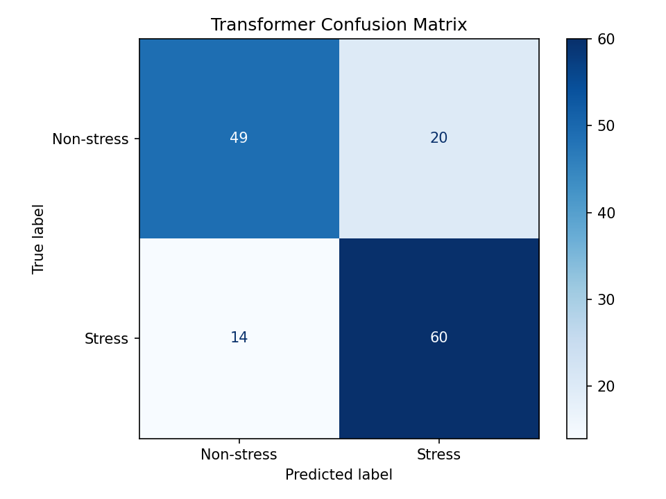{fig-alt="Transformer confusion matrix"}
:::
::: {.column width="33%"}
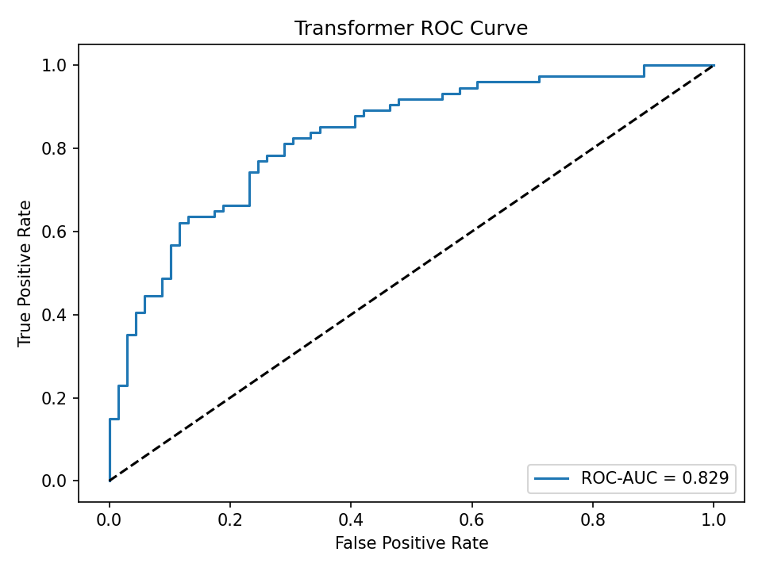{fig-alt="Transformer ROC"}
:::
::: {.column width="33%"}
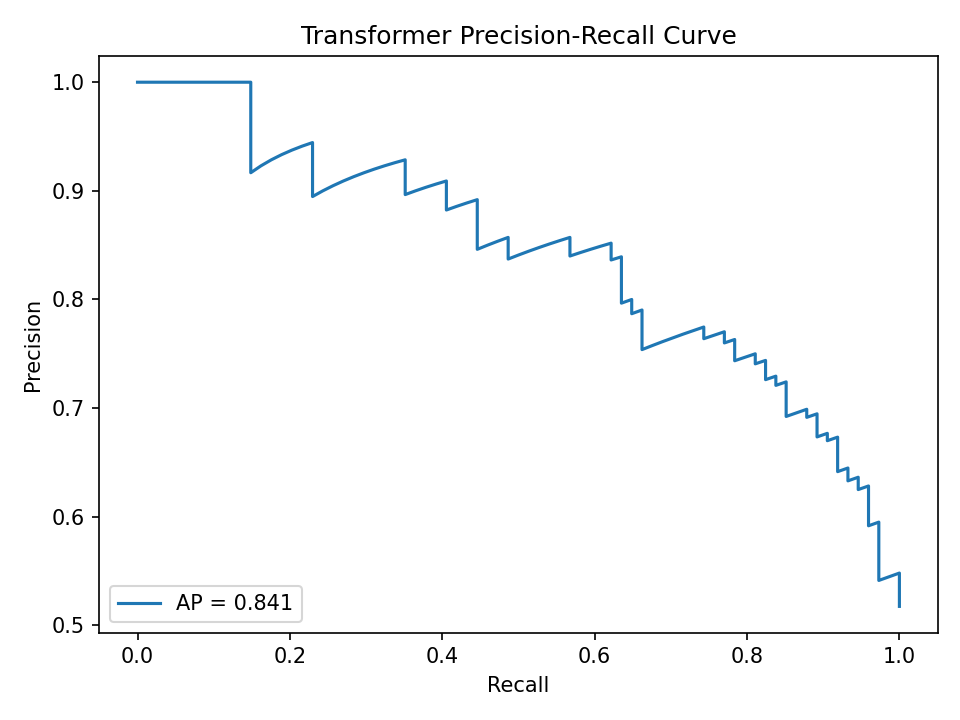{fig-alt="Transformer PR"}
:::
:::

## 13. Baseline vs Transformer

| Metric | Baseline (LogReg) | Transformer (DistilBERT) |
|---|---:|---:|
| Accuracy | 0.748 | 0.762 |
| Macro F1 | 0.748 | 0.761 |
| ROC-AUC | 0.814 | 0.829 |
| AP (PR-AUC) | 0.769 | 0.841 |

Observed pattern:

- Transformer improves ranking quality and overall discrimination
- Baseline remains competitive with much higher transparency

## 14. Explainability Notebook – Structure

`notebooks/04_explainability.ipynb` has three technical blocks:

1. Baseline explainability from logistic coefficients
2. SHAP token-level explanations for transformer predictions
3. Integrated Gradients token attribution (Captum)

This matches the README explainability plan.

## 15. Baseline Explainability (Feature-Based)

From `notebooks/04_explainability.ipynb`:

```python
coef_path = ROOT / "results" / "baseline" / "logreg_coefficients.csv"
coef_df = pd.read_csv(coef_path).sort_values("coefficient", ascending=False)
```

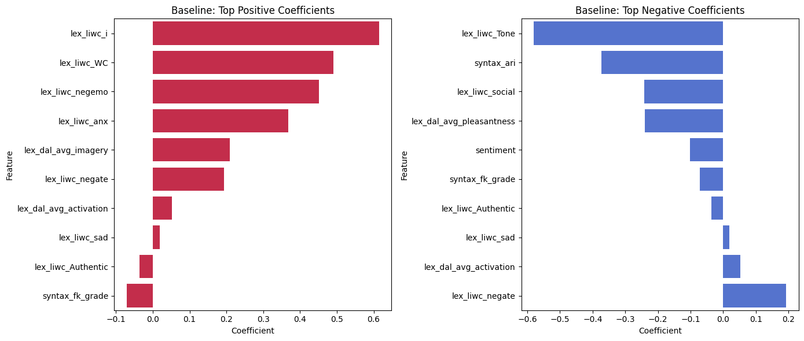{fig-alt="Baseline coefficients"}

Interpretation: global, model-level, directly auditable.

## 16. Transformer Explainability – SHAP (Local)

From `notebooks/04_explainability.ipynb`:

```python
masker = shap.maskers.Text(tokenizer)
explainer = shap.Explainer(predict_fn, masker, output_names=["non_stress", "stress"])
shap_values = explainer(shap_texts)

# class-specific explanation
shap.plots.text(shap_values[0, :, 1])  # stress class
```

::: {.columns}
::: {.column width="50%"}
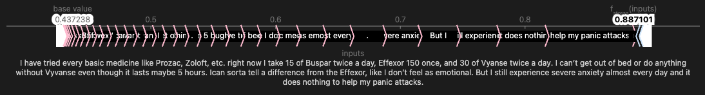{fig-alt="SHAP stress"}
:::
::: {.column width="50%"}
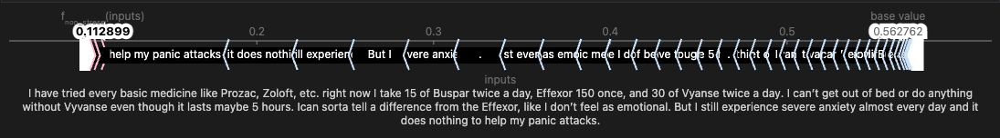{fig-alt="SHAP non-stress"}
:::
:::

## 17. Transformer Explainability – SHAP Global + Waterfall

From `notebooks/04_explainability.ipynb`:

```python
shap.plots.bar(shap_values[:,:,1])  # stress output
```

::: {.columns}
::: {.column width="50%"}
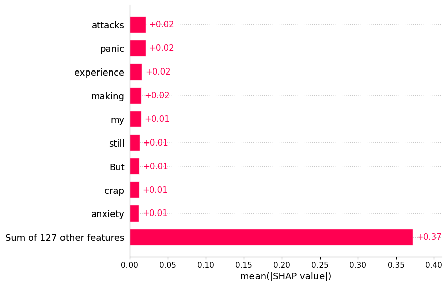{fig-alt="Global SHAP tokens"}
:::
::: {.column width="50%"}
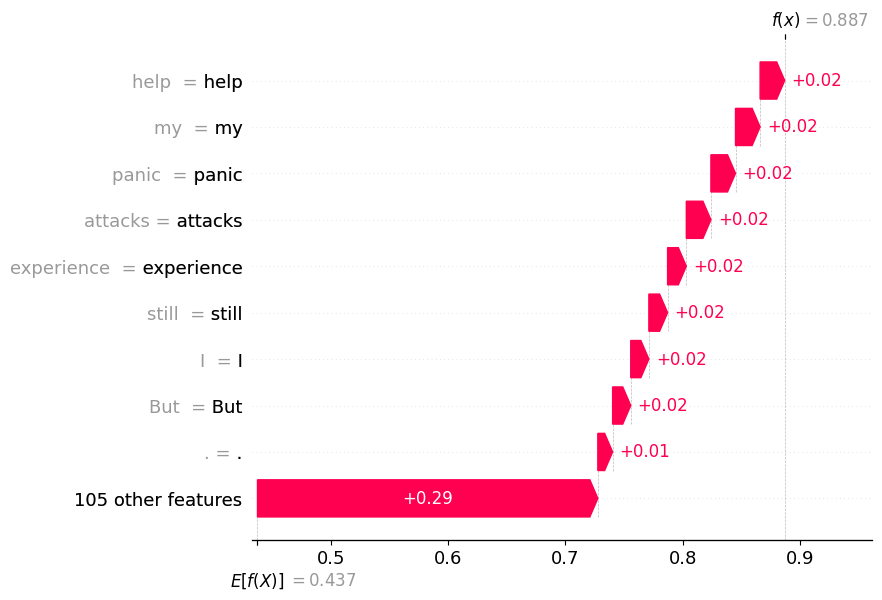{fig-alt="SHAP waterfall"}
:::
:::

## 18. Transformer Explainability – Integrated Gradients

From `notebooks/04_explainability.ipynb`:

```python
from captum.attr import IntegratedGradients

ig = IntegratedGradients(forward_emb)
attributions, delta = ig.attribute(
    embeddings,
    baselines=baseline,
    additional_forward_args=(attention_mask,),
    n_steps=32,
    return_convergence_delta=True,
)
```

Integrated Gradients is used as a gradient-based complement to SHAP.

## 19. Technical Limitations (Current Stage)

- Transformer model selection is still tied to the notebook flow
- Explainability runtime is expensive (SHAP/IG sample size kept small)
- No automated test suite yet (project still notebook-driven)

## 20. Final Takeaways

- Strong baseline with interpretable feature-level behavior
- Transformer yields better ranking and slightly better aggregate performance
- Explainability section is complete at both global and local levels
- Project is presentation-ready and technically defensible for academic review

## Thank you

Questions?
