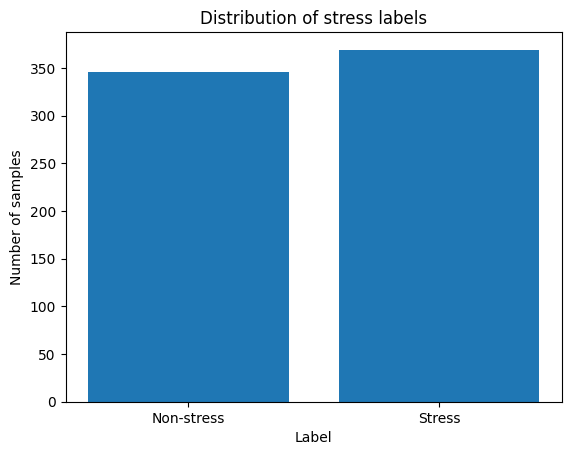
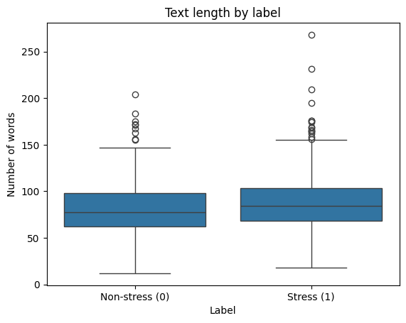

# Results Summary

This section summarizes the main findings obtained so far.

## Exploratory Analysis
- The dataset is nearly balanced between stress and non-stress posts.

- Text length alone shows limited discriminative power, with substantial overlap between classes.

- Stress-related posts exhibit a higher number of long outliers, often corresponding to extended personal narratives.

- Affective features such as sentiment and lexical pleasantness show clearer differences between classes.

## Baseline (in progress)
- An interpretable baseline using affective and linguistic features is currently being implemented.
- Preliminary results suggest that affective features provide stronger signals than surface-level statistics.

Figures referenced below illustrate key observations from the EDA.
